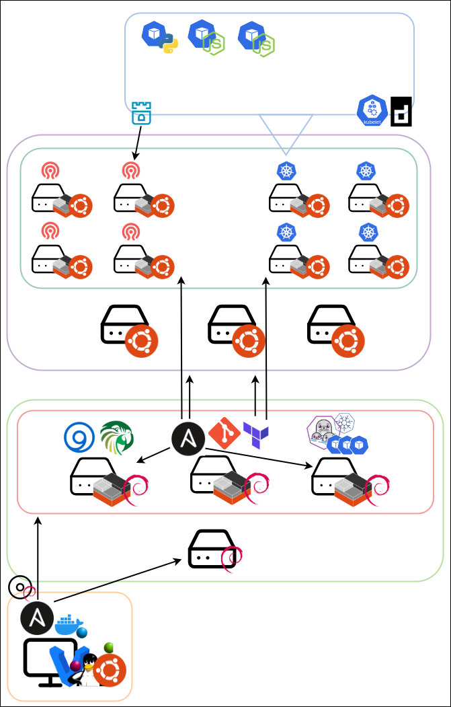

# infrastructure

my infrastructure as code. contains personal configuration

here is a rough primitive soon-to-be-current architecture overview



the git logo represents an origin of frequent provisioning operations

the plan is to create ubuntu lxd machine containers on several of my physical machines, geared towards either storage or processing, and build either a ceph and kubernetes cluster or an opennebula cloud environment on top of that

## layout

responsibilities of each folder

- base
  - create image

- foundation
  - create image
  - provision foundation (with lxd containers and ssh keys generated in `/ordinal`)

- ordinal (lxd containers on foundation)
  - provision ordinal machines

## installation

some make commands depend on make commands from other folders to be executed (ex. you must create public keys in `/ordinal` before the remote ansible provisioning in `/foundation`). these dependencies are checked for the commands that require them, and will error (and output useful info to console) if unsatisfied

```sh
git clone https://github.com/eankeen/corsac
cd "corsac/$folder"
make bootstrap
make ${folder-specific-command}
```
